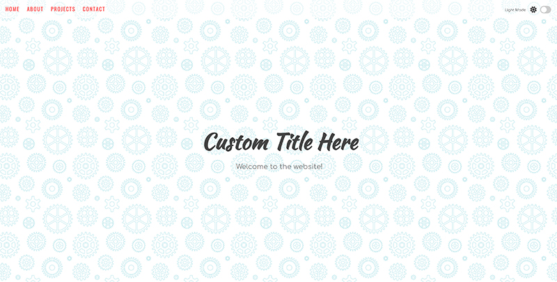

# Zero To Mastery - Light Dark Mode Javascript Project

This is a solution to the Infinity Scroll project on [Zero To Mastery](https://zerotomastery.io/). Zero To Mastery projects help you improve your coding skills by building realistic projects. 

## Table of contents

- [Overview](#overview)
  - [The challenge](#the-challenge)
  - [Screenshot](#screenshot)
  - [Links](#links)
- [My process](#my-process)
  - [Built with](#built-with)
  - [What I learned](#what-i-learned)
  - [Continued development](#continued-development)
  - [Useful resources](#useful-resources)
- [Author](#author)
- [Acknowledgments](#acknowledgments)

**Note: Delete this note and update the table of contents based on what sections you keep.**

## Overview

### The challenge

Users should be able to:

- Change the theme of the website from light to dark
- Elements of the page will have different styles to match the chosen theme
- Theme choice is stored in localstorage

### Screenshot

### Links

- Live Site URL: [Light Dark Theme](https://robertwalker68501.github.io/light-dark-mode/)

## My process

### Built with

- Semantic HTML5 markup
- CSS custom properties
- JavaScript
- Localstorage
- Flexbox
- Mobile-first workflow

### Continued development

I will keep improving the site. Make it look nicer and maybe more functionality to it.

## Author

- LinkedIn - [LinkedIn](https://www.linkedin.com/in/robert-walker-029503221/)
- Twitter - [@RobertW15135868](https://www.twitter.com/RobertW15135868)